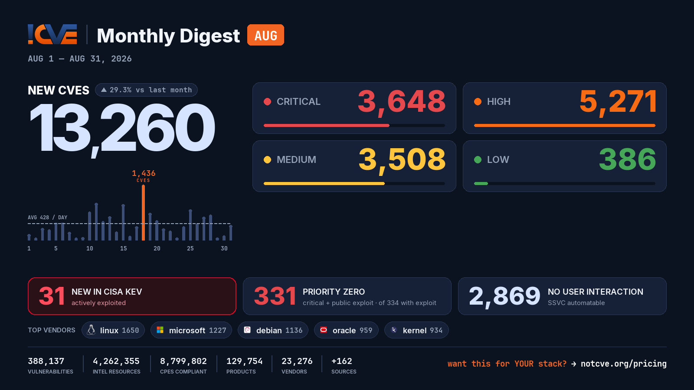

# 📊 Monthly Vulnerability Digest — August 2026

> Data window: 2026-08-01 → 2026-09-01 (UTC). Every figure in this report is generated deterministically from the [NotCVE](https://notcve.org) corpus and machine-validated — nothing is estimated.

## At a glance

- 🆕 **13,260 new CVEs** — 29.3% more than the previous month's 10,255
- 📅 **428 per day** on average
- 📈 **Peak day: 1,436** published on Aug 18 alone — 920 from oracle
- 🔴 **3648 rated critical** (CVSS ≥ 9)
- 💥 **334 with a public exploit** already available
- 🚩 **331 rated critical AND with a public exploit**
- 🤖 **2,869 no user interaction needed** to exploit (CISA SSVC automatable)
- ⚠️ **31 added to CISA KEV** — actively exploited

## Severity of new CVEs

| Severity | Count | Distribution |
|---|---:|---|
| Critical | 3648 | `████████░░░░` |
| High | 5271 | `████████████` |
| Medium | 3508 | `████████░░░░` |
| Low | 386 | `█░░░░░░░░░░░` |

## Top vendors

| Vendor | New CVEs | |
|---|---:|---|
| [linux](https://notcve.org/vendors/linux/) | 1650 | `████████████` |
| [microsoft](https://notcve.org/vendors/microsoft/) | 1227 | `█████████░░░` |
| [debian](https://notcve.org/vendors/debian/) | 1136 | `████████░░░░` |
| [oracle](https://notcve.org/vendors/oracle/) | 959 | `███████░░░░░` |
| [kernel](https://notcve.org/vendors/kernel/) | 934 | `███████░░░░░` |
| [amazon](https://notcve.org/vendors/amazon/) | 684 | `█████░░░░░░░` |
| [ibm](https://notcve.org/vendors/ibm/) | 509 | `████░░░░░░░░` |
| [google](https://notcve.org/vendors/google/) | 412 | `███░░░░░░░░░` |

## Top products

| Product | Vendor | New CVEs |
|---|---|---:|
| [linux_kernel](https://notcve.org/vendors/linux/products/linux~20kernel/) | [linux](https://notcve.org/vendors/linux/) | 1650 |
| [debian_linux](https://notcve.org/vendors/debian/products/debian~20linux/) | [debian](https://notcve.org/vendors/debian/) | 1128 |
| [bpftool](https://notcve.org/vendors/kernel/products/bpftool/) | [kernel](https://notcve.org/vendors/kernel/) | 934 |
| [azure_linux](https://notcve.org/vendors/microsoft/products/azure~20linux/) | [microsoft](https://notcve.org/vendors/microsoft/) | 709 |
| [amazon_linux](https://notcve.org/vendors/amazon/products/amazon~20linux/) | [amazon](https://notcve.org/vendors/amazon/) | 657 |
| [chromium](https://notcve.org/vendors/chromium/products/chromium/) | chromium | 396 |
| [chrome](https://notcve.org/vendors/google/products/chrome/) | [google](https://notcve.org/vendors/google/) | 396 |
| [ubuntu_linux](https://notcve.org/vendors/canonical/products/ubuntu~20linux/) | canonical | 383 |

## ⚠️ New in CISA KEV — actively exploited

| CVE | Title | CVSS | Added |
|---|---|---:|---|
| [CVE-2026-81578](https://notcve.org/cve/CVE-2026-81578/) | PaperCut NG/MF Missing Authentication for Critical Function Vulnerability | 9.8 | 2026-08-31 |
| [CVE-2026-82078](https://notcve.org/cve/CVE-2026-82078/) | PaperCut NG/MF Unsafe Reflection Vulnerability | 9.4 | 2026-08-31 |
| [CVE-2026-53362](https://notcve.org/cve/CVE-2026-53362/) | Linux Kernel Unspecified Vulnerability | 7.8 | 2026-08-27 |
| [CVE-2026-66384](https://notcve.org/cve/CVE-2026-66384/) | JFrog Artifactory Improper Limitation of a Pathname to a Restricted Directory Vulnerability | 5.3 | 2026-08-27 |
| [CVE-2023-49105](https://notcve.org/cve/CVE-2023-49105/) | ownCloud Improper Authentication Vulnerability | 9.8 | 2026-08-27 |
| [CVE-2021-23758](https://notcve.org/cve/CVE-2021-23758/) | Ajax.NET Professional Deserialization of Untrusted Data Vulnerability | 9.8 | 2026-08-26 |
| [CVE-2015-5287](https://notcve.org/cve/CVE-2015-5287/) | Red Hat Automatic Bug Reporting Tool Privilege Escalation Vulnerability | 7.8 | 2026-08-26 |
| [CVE-2022-0995](https://notcve.org/cve/CVE-2022-0995/) | Linux Kernel Out-of-Bounds Write Vulnerability | 9.8 | 2026-08-26 |
| [CVE-2026-8452](https://notcve.org/cve/CVE-2026-8452/) | Citrix NetScaler ADC and NetScaler Gateway Improper Restriction of Operations within the Bounds of a Memory Buffer Vulnerability | 9.8 | 2026-08-26 |
| [CVE-2015-3246](https://notcve.org/cve/CVE-2015-3246/) | Red Hat Libuser Race Condition Vulnerability | 7.8 | 2026-08-26 |

## Highest CVSS among new CVEs

| CVE | Title | CVSS |
|---|---|---:|
| [CVE-2026-73299](https://notcve.org/cve/CVE-2026-73299/) | Prompty: Server-Side Template Injection to Remote Code Execution in the @prompty/core Nunjucks Renderer | 10 |
| [CVE-2026-55107](https://notcve.org/cve/CVE-2026-55107/) | kobako Sandbox Escape: guest eval reaches host RCE via method_missing → public_send (any bound Service) | 10 |
| [CVE-2026-33591](https://notcve.org/cve/CVE-2026-33591/) | Authentication bypass on WaptServer | 10 |
| [CVE-2026-19977](https://notcve.org/cve/CVE-2026-19977/) | EFM ipTIME A3004T Session Validation httpcon_check_session_url improper authentication | 10 |
| [CVE-2026-45618](https://notcve.org/cve/CVE-2026-45618/) | LiquidJS is Vulnerable to Remote Code Execution | 10 |

## Highest EPSS among new CVEs

| CVE | Title | EPSS | CVSS |
|---|---|---:|---:|
| [CVE-2026-60004](https://notcve.org/cve/CVE-2026-60004/) | Gitea Code Injection Vulnerability | 84.6% | 9.8 |
| [CVE-2026-72898](https://notcve.org/cve/CVE-2026-72898/) | Metabase SQL Injection Vulnerability | 82.3% | 10 |
| [CVE-2026-18577](https://notcve.org/cve/CVE-2026-18577/) | N-able N-central Authentication Bypass Using an Alternate Path or Channel Vulnerability | 54.1% | 9.8 |
| [CVE-2026-18556](https://notcve.org/cve/CVE-2026-18556/) | N-able N-central Authentication Bypass Using an Alternate Path or Channel Vulnerability | 40.2% | 9.8 |
| [CVE-2026-64638](https://notcve.org/cve/CVE-2026-64638/) | WordPress Core <= 7.0.2 - Unauthenticated Reflected Cross-Site Scripting via log Parameter | 31.2% | 9.8 |

## Triage signals

- 🤖 **SSVC breakdown**: 2,869 automatable (914 of them with total technical impact) · exploitation status: 14 active, 2244 PoC
- 🌊 **Widest blast radius**: [CVE-2026-25292](https://notcve.org/cve/CVE-2026-25292/) — 450 products, 0 versions (Improper Validation of Syntactic Correctness of Input in Automotive Linux OS)

## Top CNAs (who assigned this month)

| CNA | New CVEs |
|---|---:|
| Linux | 1650 |
| VulnCheck | 1436 |
| GitHub_M | 1382 |
| oracle | 889 |
| VulDB | 684 |

---

**About this series** — published on the 1st of every month from the NotCVE corpus: 388,137 vulnerability records · 4,262,355 intel resources · 8,799,802 CPEs compliant · 129,754 products · 23,276 vendors · 162 monitored sources → [notcve.org](https://notcve.org)
