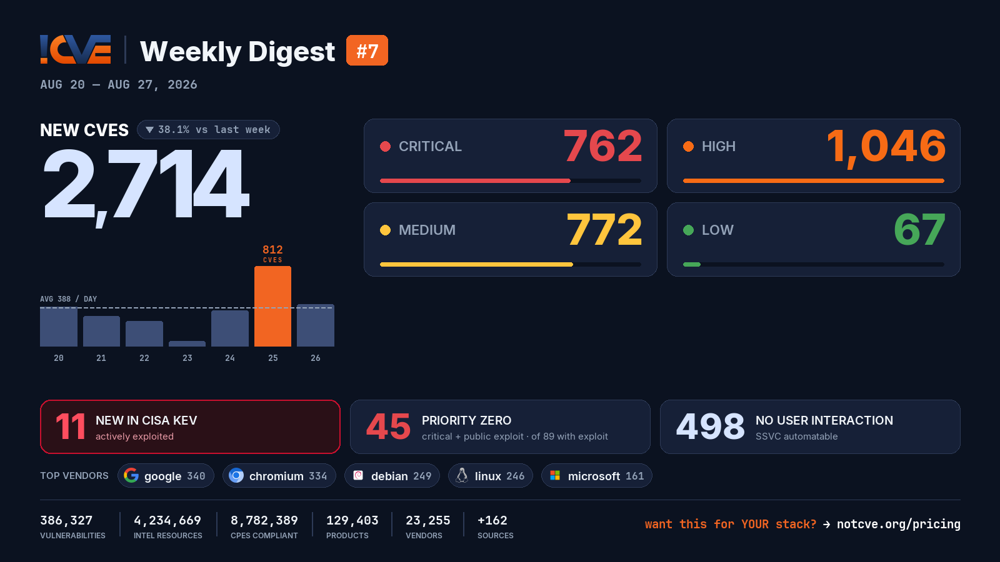

# 📊 Weekly Vulnerability Digest #7 — Aug 20–27, 2026

> Data window: 2026-08-20 → 2026-08-27 (UTC). Every figure in this report is generated deterministically from the [NotCVE](https://notcve.org) corpus and machine-validated — nothing is estimated.

## At a glance

- 🆕 **2,714 new CVEs** — 38.1% fewer than the previous week's 4,383
- 📅 **388 per day** on average
- 📈 **Peak day: 812** published on Aug 25 alone — 327 from chromium
- 🔴 **762 rated critical** (CVSS ≥ 9)
- 💥 **89 with a public exploit** already available
- 🚩 **45 rated critical AND with a public exploit**
- 🤖 **498 no user interaction needed** to exploit (CISA SSVC automatable)
- ⚠️ **11 added to CISA KEV** — actively exploited

## Severity of new CVEs

| Severity | Count | Distribution |
|---|---:|---|
| Critical | 762 | `█████████░░░` |
| High | 1046 | `████████████` |
| Medium | 772 | `█████████░░░` |
| Low | 67 | `█░░░░░░░░░░░` |

## Top vendors

| Vendor | New CVEs | |
|---|---:|---|
| [google](https://notcve.org/vendors/google/) | 340 | `████████████` |
| [chromium](https://notcve.org/vendors/chromium/) | 334 | `████████████` |
| [debian](https://notcve.org/vendors/debian/) | 249 | `█████████░░░` |
| [linux](https://notcve.org/vendors/linux/) | 246 | `█████████░░░` |
| [microsoft](https://notcve.org/vendors/microsoft/) | 161 | `██████░░░░░░` |
| [kernel](https://notcve.org/vendors/kernel/) | 143 | `█████░░░░░░░` |
| [ibm](https://notcve.org/vendors/ibm/) | 89 | `███░░░░░░░░░` |
| [apache](https://notcve.org/vendors/apache/) | 54 | `██░░░░░░░░░░` |

## Top products

| Product | Vendor | New CVEs |
|---|---|---:|
| [chromium](https://notcve.org/vendors/chromium/products/chromium/) | [chromium](https://notcve.org/vendors/chromium/) | 334 |
| [chrome](https://notcve.org/vendors/google/products/chrome/) | [google](https://notcve.org/vendors/google/) | 334 |
| [linux_kernel](https://notcve.org/vendors/linux/products/linux~20kernel/) | [linux](https://notcve.org/vendors/linux/) | 246 |
| [debian_linux](https://notcve.org/vendors/debian/products/debian~20linux/) | [debian](https://notcve.org/vendors/debian/) | 241 |
| [bpftool](https://notcve.org/vendors/kernel/products/bpftool/) | [kernel](https://notcve.org/vendors/kernel/) | 143 |
| [azure_linux](https://notcve.org/vendors/microsoft/products/azure~20linux/) | [microsoft](https://notcve.org/vendors/microsoft/) | 138 |
| [aix](https://notcve.org/vendors/ibm/products/aix/) | [ibm](https://notcve.org/vendors/ibm/) | 75 |
| [powervm](https://notcve.org/vendors/ibm/products/powervm/) | [ibm](https://notcve.org/vendors/ibm/) | 75 |

## ⚠️ New in CISA KEV — actively exploited

| CVE | Title | CVSS | Added |
|---|---|---:|---|
| [CVE-2021-23758](https://notcve.org/cve/CVE-2021-23758/) | Ajax.NET Professional Deserialization of Untrusted Data Vulnerability | 9.8 | 2026-08-26 |
| [CVE-2019-1068](https://notcve.org/cve/CVE-2019-1068/) | Microsoft SQL Server Remote Code Execution Vulnerability | 8.8 | 2026-08-26 |
| [CVE-2015-5287](https://notcve.org/cve/CVE-2015-5287/) | Red Hat Automatic Bug Reporting Tool Privilege Escalation Vulnerability | 7.8 | 2026-08-26 |
| [CVE-2022-0995](https://notcve.org/cve/CVE-2022-0995/) | Linux Kernel Out-of-Bounds Write Vulnerability | 9.8 | 2026-08-26 |
| [CVE-2026-8452](https://notcve.org/cve/CVE-2026-8452/) | Citrix NetScaler ADC and NetScaler Gateway Improper Restriction of Operations within the Bounds of a Memory Buffer Vulnerability | 9.8 | 2026-08-26 |
| [CVE-2015-3246](https://notcve.org/cve/CVE-2015-3246/) | Red Hat Libuser Race Condition Vulnerability | 7.8 | 2026-08-26 |
| [CVE-2026-60004](https://notcve.org/cve/CVE-2026-60004/) | Gitea Code Injection Vulnerability | 9.8 | 2026-08-25 |
| [CVE-2026-21962](https://notcve.org/cve/CVE-2026-21962/) | Oracle HTTP Server and Oracle Weblogic Server Proxy Plug-in Improper Access Control Vulnerability | 10 | 2026-08-24 |
| [CVE-2026-73570](https://notcve.org/cve/CVE-2026-73570/) | Zimbra Collaboration Suite (ZCS) OS Command Injection Vulnerability | 8.9 | 2026-08-21 |
| [CVE-2026-72530](https://notcve.org/cve/CVE-2026-72530/) | TrueConf Server Code Injection Vulnerability | 9.5 | 2026-08-20 |

## Highest CVSS among new CVEs

| CVE | Title | CVSS |
|---|---|---:|
| [CVE-2026-78167](https://notcve.org/cve/CVE-2026-78167/) | EFM ipTIME T16000M Session Validation httpcon_check_session_url improper authentication | 10 |
| [CVE-2026-53710](https://notcve.org/cve/CVE-2026-53710/) | mcp-contextforge-gateway has RestrictedPython sandbox bypass via getattr builtin in python_sandbox_server | 10 |
| [CVE-2025-36939](https://notcve.org/cve/CVE-2025-36939/) | — | 10 |
| [CVE-2026-77946](https://notcve.org/cve/CVE-2026-77946/) | TRENDnet TEW-821DAP NTP Timezone Configuration apply_time.cgi uci_safe_get stack-based overflow | 10 |
| [CVE-2026-76195](https://notcve.org/cve/CVE-2026-76195/) | Adobe Campaign Classic (ACC) \| Improper Neutralization of Special Elements used in an OS Command ('OS Command Injection' | 10 |

## Highest EPSS among new CVEs

| CVE | Title | EPSS | CVSS |
|---|---|---:|---:|
| [CVE-2026-19586](https://notcve.org/cve/CVE-2026-19586/) | Pre-Authentication OS Command Injection in Omada Gateways on OpenVPN Server in Omada Gateways | 5% | 9.3 |
| [CVE-2026-71921](https://notcve.org/cve/CVE-2026-71921/) | DrayTek VigorSwitch Multiple Models Pre-Authentication OS Command Injection via setget.cgi | 3.2% | 9.8 |
| [CVE-2026-71917](https://notcve.org/cve/CVE-2026-71917/) | DrayTek VigorSwitch Multiple Models OS Command Injection via pingtrace | 3.1% | 8.6 |
| [CVE-2026-71915](https://notcve.org/cve/CVE-2026-71915/) | DrayTek VigorSwitch Multiple Models OS Command Injection via jsonstatus | 3.1% | 8.6 |
| [CVE-2026-71908](https://notcve.org/cve/CVE-2026-71908/) | DrayTek VigorAP Multiple Models OS Command Injection via mesh_start_speed_test | 3.1% | 8.6 |

## Triage signals

- 🤖 **SSVC breakdown**: 498 automatable (163 of them with total technical impact) · exploitation status: 1 active, 361 PoC
- 🌊 **Widest blast radius**: [CVE-2026-29988](https://notcve.org/cve/CVE-2026-29988/) — 64 products, 0 versions (Milesight AM102/102L V2 — Cleartext Transmission of Sensitive Information)

## Top CNAs (who assigned this week)

| CNA | New CVEs |
|---|---:|
| VulnCheck | 379 |
| Chrome | 332 |
| GitHub_M | 327 |
| Linux | 246 |
| VulDB | 114 |

---

**About this series** — published every Thursday from the NotCVE corpus: 386,327 vulnerability records · 4,234,669 intel resources · 8,782,389 CPEs compliant · 129,403 products · 23,255 vendors · 162 monitored sources → [notcve.org](https://notcve.org)
