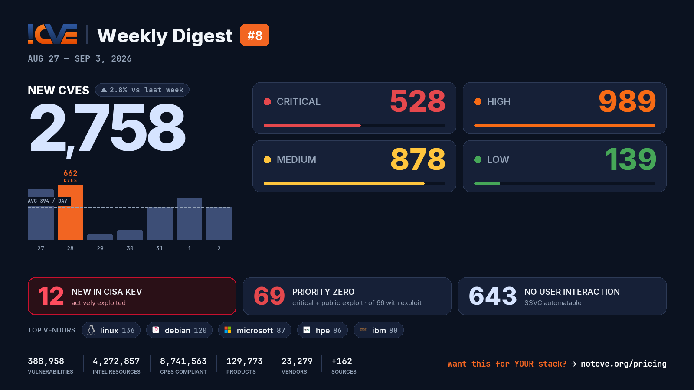

# 📊 Weekly Vulnerability Digest #8 — Aug 27 – Sep 3, 2026

> Data window: 2026-08-27 → 2026-09-03 (UTC). Every figure in this report is generated deterministically from the [NotCVE](https://notcve.org) corpus and machine-validated — nothing is estimated.

## At a glance

- 🆕 **2,758 new CVEs** — 2.8% more than the previous week's 2,682
- 📅 **394 per day** on average
- 📈 **Peak day: 662** published on Aug 28 alone
- 🔴 **528 rated critical** (CVSS ≥ 9)
- 💥 **66 with a public exploit** already available
- 🚩 **69 rated critical AND with a public exploit**
- 🤖 **643 no user interaction needed** to exploit (CISA SSVC automatable)
- ⚠️ **12 added to CISA KEV** — actively exploited

## Severity of new CVEs

| Severity | Count | Distribution |
|---|---:|---|
| Critical | 528 | `██████░░░░░░` |
| High | 989 | `████████████` |
| Medium | 878 | `███████████░` |
| Low | 139 | `██░░░░░░░░░░` |

## Top vendors

| Vendor | New CVEs | |
|---|---:|---|
| [linux](https://notcve.org/vendors/linux/) | 136 | `████████████` |
| [debian](https://notcve.org/vendors/debian/) | 120 | `███████████░` |
| [microsoft](https://notcve.org/vendors/microsoft/) | 87 | `████████░░░░` |
| [hpe](https://notcve.org/vendors/hpe/) | 86 | `████████░░░░` |
| [ibm](https://notcve.org/vendors/ibm/) | 80 | `███████░░░░░` |
| [vmware](https://notcve.org/vendors/vmware/) | 66 | `██████░░░░░░` |
| [kernel](https://notcve.org/vendors/kernel/) | 64 | `██████░░░░░░` |
| [redhat](https://notcve.org/vendors/redhat/) | 56 | `█████░░░░░░░` |

## Top products

| Product | Vendor | New CVEs |
|---|---|---:|
| [linux_kernel](https://notcve.org/vendors/linux/products/linux~20kernel/) | [linux](https://notcve.org/vendors/linux/) | 136 |
| [debian_linux](https://notcve.org/vendors/debian/products/debian~20linux/) | [debian](https://notcve.org/vendors/debian/) | 120 |
| [azure_linux](https://notcve.org/vendors/microsoft/products/azure~20linux/) | [microsoft](https://notcve.org/vendors/microsoft/) | 77 |
| [spring](https://notcve.org/vendors/vmware/products/spring/) | [vmware](https://notcve.org/vendors/vmware/) | 64 |
| [bpftool](https://notcve.org/vendors/kernel/products/bpftool/) | [kernel](https://notcve.org/vendors/kernel/) | 62 |
| [openssl_encrypt](https://notcve.org/vendors/jahlives/products/openssl~20encrypt/) | jahlives | 36 |
| [fabric_composer](https://notcve.org/vendors/arubanetworks/products/fabric~20composer/) | arubanetworks | 35 |
| [enterprise_linux](https://notcve.org/vendors/redhat/products/enterprise~20linux/) | [redhat](https://notcve.org/vendors/redhat/) | 35 |

## ⚠️ New in CISA KEV — actively exploited

| CVE | Title | CVSS | Added |
|---|---|---:|---|
| [CVE-2026-82329](https://notcve.org/cve/CVE-2026-82329/) | JFrog Artifactory Improper Authentication Vulnerability | 9.8 | 2026-09-02 |
| [CVE-2026-9586](https://notcve.org/cve/CVE-2026-9586/) | Sangoma Switchvox SQL Injection Vulnerability | 9.8 | 2026-09-02 |
| [CVE-2026-83548](https://notcve.org/cve/CVE-2026-83548/) | SonicWall SMA1000 Appliances Server-Side Request Forgery Vulnerability | 10 | 2026-09-02 |
| [CVE-2026-83549](https://notcve.org/cve/CVE-2026-83549/) | SonicWall SMA1000 Appliances OS Command Injection Vulnerability | 7.8 | 2026-09-02 |
| [CVE-2026-59822](https://notcve.org/cve/CVE-2026-59822/) | BerriAI LiteLLM Improper Authentication Vulnerability | 8.8 | 2026-09-02 |
| [CVE-2026-49869](https://notcve.org/cve/CVE-2026-49869/) | Kestra OSS OS Command Injection Vulnerability | 10 | 2026-09-02 |
| [CVE-2026-48710](https://notcve.org/cve/CVE-2026-48710/) | Kludex Starlette HTTP Request/Response Smuggling Vulnerability | 6.5 | 2026-09-02 |
| [CVE-2026-81578](https://notcve.org/cve/CVE-2026-81578/) | PaperCut NG/MF Missing Authentication for Critical Function Vulnerability | 9.8 | 2026-08-31 |
| [CVE-2026-82078](https://notcve.org/cve/CVE-2026-82078/) | PaperCut NG/MF Unsafe Reflection Vulnerability | 9.4 | 2026-08-31 |
| [CVE-2026-53362](https://notcve.org/cve/CVE-2026-53362/) | Linux Kernel Unspecified Vulnerability | 7.8 | 2026-08-27 |

## Highest CVSS among new CVEs

| CVE | Title | CVSS |
|---|---|---:|
| [CVE-2026-81096](https://notcve.org/cve/CVE-2026-81096/) | ToolUniverse through 1.2.6 Unauthenticated Remote Code Execution via python_code_executor Sandbox Escape | 10 |
| [CVE-2026-82970](https://notcve.org/cve/CVE-2026-82970/) | WPLP Cookie Consent – Cookie Banner & Consent Management for GDPR, CCPA & Google Consent Mode <= 4.4.1 - Unauthenticated | 10 |
| [CVE-2026-74820](https://notcve.org/cve/CVE-2026-74820/) | Unauthenticated SQL Injection via Dynamic Schema ORDER BY Clause | 10 |
| [CVE-2026-54745](https://notcve.org/cve/CVE-2026-54745/) | Kubeflow Pipelines: Unauthenticated SSRF and HTTP smuggling in Kubeflow Pipelines frontend /_proxy/ route, bypasses ENAB | 10 |
| [CVE-2026-82694](https://notcve.org/cve/CVE-2026-82694/) | Tenda AC1206 Web UI ate R7WebsSecurityHandler missing authentication | 10 |

## Highest EPSS among new CVEs

| CVE | Title | EPSS | CVSS |
|---|---|---:|---:|
| [CVE-2026-47864](https://notcve.org/cve/CVE-2026-47864/) | Unsafe Java deserialization in SerializingHttpMessageConverter — remote code execution | 3.4% | 9.8 |
| [CVE-2026-82688](https://notcve.org/cve/CVE-2026-82688/) | D-Link DNS-340L/DNS-345 Virtual Volume virtual_vol.cgi os command injection | 2.8% | 9.4 |
| [CVE-2026-74233](https://notcve.org/cve/CVE-2026-74233/) | Zbtlink MQWrt infosrvd Command Injection | 2.6% | 9.8 |
| [CVE-2026-82692](https://notcve.org/cve/CVE-2026-82692/) | D-Link DNS-340L/DNS-345 iscsi_mgr.cgi os command injection | 2.4% | 9.9 |
| [CVE-2026-82689](https://notcve.org/cve/CVE-2026-82689/) | D-Link DNS-320L/DNS-327L/DNS-340L/DNS-345 ISO Image isomount_mgr.cgi os command injection | 2.4% | 9.9 |

## Triage signals

- 🤖 **SSVC breakdown**: 643 automatable (206 of them with total technical impact) · exploitation status: 5 active, 481 PoC
- 🌊 **Widest blast radius**: [CVE-2023-20577](https://notcve.org/cve/CVE-2023-20577/) — 35 products, 0 versions (hw: amd: SPI flash RCE)

## Top CNAs (who assigned this week)

| CNA | New CVEs |
|---|---:|
| VulnCheck | 347 |
| mitre | 262 |
| GitHub_M | 196 |
| VulDB | 181 |
| intel | 147 |

---

**About this series** — published every Thursday from the NotCVE corpus: 388,958 vulnerability records · 4,272,857 intel resources · 8,741,563 CPEs compliant · 129,773 products · 23,279 vendors · 162 monitored sources → [notcve.org](https://notcve.org)
