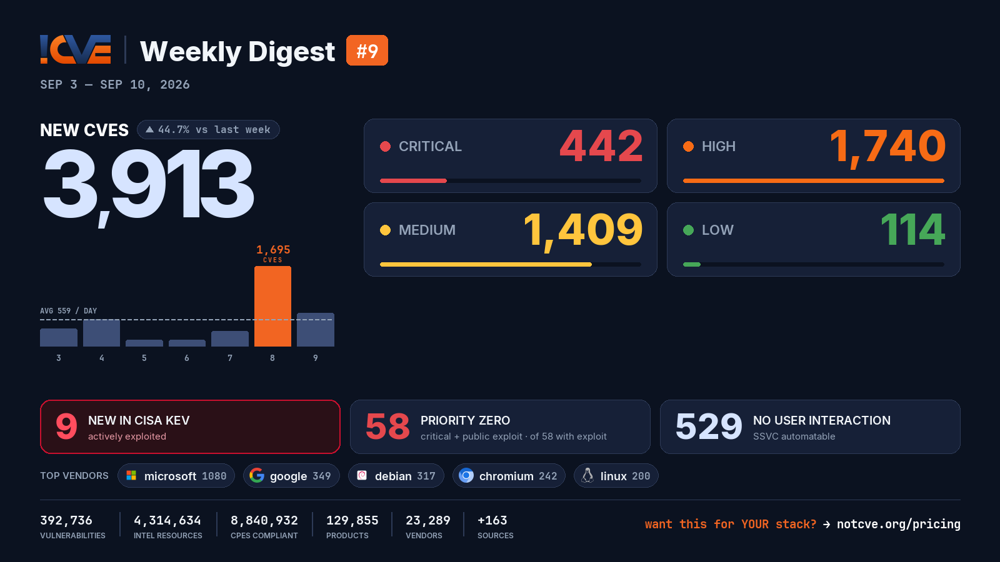

# 📊 Weekly Vulnerability Digest #9 — Sep 3–10, 2026

> Data window: 2026-09-03 → 2026-09-10 (UTC). Every figure in this report is generated deterministically from the [NotCVE](https://notcve.org) corpus and machine-validated — nothing is estimated.

## At a glance

- 🆕 **3,913 new CVEs** — 44.7% more than the previous week's 2,704
- 📅 **559 per day** on average
- 📈 **Peak day: 1,695** published on Sep 8 alone — 966 from microsoft (Patch Tuesday)
- 🔴 **442 rated critical** (CVSS ≥ 9)
- 💥 **58 with a public exploit** already available
- 🚩 **58 rated critical AND with a public exploit**
- 🤖 **529 no user interaction needed** to exploit (CISA SSVC automatable)
- ⚠️ **9 added to CISA KEV** — actively exploited

## Severity of new CVEs

| Severity | Count | Distribution |
|---|---:|---|
| Critical | 442 | `███░░░░░░░░░` |
| High | 1740 | `████████████` |
| Medium | 1409 | `██████████░░` |
| Low | 114 | `█░░░░░░░░░░░` |

## Top vendors

| Vendor | New CVEs | |
|---|---:|---|
| [microsoft](https://notcve.org/vendors/microsoft/) | 1080 | `████████████` |
| [google](https://notcve.org/vendors/google/) | 349 | `████░░░░░░░░` |
| [debian](https://notcve.org/vendors/debian/) | 317 | `████░░░░░░░░` |
| [chromium](https://notcve.org/vendors/chromium/) | 242 | `███░░░░░░░░░` |
| [linux](https://notcve.org/vendors/linux/) | 200 | `██░░░░░░░░░░` |
| [adobe](https://notcve.org/vendors/adobe/) | 170 | `██░░░░░░░░░░` |
| [ibm](https://notcve.org/vendors/ibm/) | 143 | `██░░░░░░░░░░` |
| [dell](https://notcve.org/vendors/dell/) | 114 | `█░░░░░░░░░░░` |

## Top products

| Product | Vendor | New CVEs |
|---|---|---:|
| [windows_server_2025](https://notcve.org/vendors/microsoft/products/windows~20server~202025/) | [microsoft](https://notcve.org/vendors/microsoft/) | 678 |
| [windows_server_2022](https://notcve.org/vendors/microsoft/products/windows~20server~202022/) | [microsoft](https://notcve.org/vendors/microsoft/) | 640 |
| [windows_11_24h2](https://notcve.org/vendors/microsoft/products/windows~2011~2024h2/) | [microsoft](https://notcve.org/vendors/microsoft/) | 628 |
| [windows_11_25h2](https://notcve.org/vendors/microsoft/products/windows~2011~2025h2/) | [microsoft](https://notcve.org/vendors/microsoft/) | 627 |
| [windows_11_26h1](https://notcve.org/vendors/microsoft/products/windows~2011~2026h1/) | [microsoft](https://notcve.org/vendors/microsoft/) | 627 |
| [windows_server_2019](https://notcve.org/vendors/microsoft/products/windows~20server~202019/) | [microsoft](https://notcve.org/vendors/microsoft/) | 615 |
| [windows_10_1809](https://notcve.org/vendors/microsoft/products/windows~2010~201809/) | [microsoft](https://notcve.org/vendors/microsoft/) | 611 |
| [windows_11_23h2](https://notcve.org/vendors/microsoft/products/windows~2011~2023h2/) | [microsoft](https://notcve.org/vendors/microsoft/) | 601 |

## ⚠️ New in CISA KEV — actively exploited

| CVE | Title | CVSS | Added |
|---|---|---:|---|
| [CVE-2026-19490](https://notcve.org/cve/CVE-2026-19490/) | Citrix NetScaler Authentication Bypass Using an Alternate Path or Channel Vulnerability | 9.3 | 2026-09-09 |
| [CVE-2026-20079](https://notcve.org/cve/CVE-2026-20079/) | Cisco Firewall Management Center Authentication Bypass Using an Alternate Path or Channel Vulnerability | 10 | 2026-09-09 |
| [CVE-2026-87491](https://notcve.org/cve/CVE-2026-87491/) | Google Chromium V8 Out of Bounds Write Vulnerability | 8.8 | 2026-09-09 |
| [CVE-2025-25249](https://notcve.org/cve/CVE-2025-25249/) | Fortinet Multiple Products Heap-based Buffer Overflow Vulnerability | 9.8 | 2026-09-09 |
| [CVE-2026-86218](https://notcve.org/cve/CVE-2026-86218/) | N-able N-central Static Code Injection Vulnerability | 10 | 2026-09-08 |
| [CVE-2026-75650](https://notcve.org/cve/CVE-2026-75650/) | Adobe Commerce and Magento Improper Neutralization of Special Elements Used in a Template Engine Vulnerability | 10 | 2026-09-08 |
| [CVE-2026-85880](https://notcve.org/cve/CVE-2026-85880/) | Microsoft Windows Heap-Based Buffer Overflow Vulnerability | 7.8 | 2026-09-08 |
| [CVE-2026-81963](https://notcve.org/cve/CVE-2026-81963/) | Microsoft Windows Link Following Vulnerability | 7.8 | 2026-09-08 |
| [CVE-2026-85046](https://notcve.org/cve/CVE-2026-85046/) | Google Chromium V8 Type Confusion Vulnerability | 8.8 | 2026-09-04 |

## Highest CVSS among new CVEs

| CVE | Title | CVSS |
|---|---|---:|
| [CVE-2026-82710](https://notcve.org/cve/CVE-2026-82710/) | Terminal escape sequence injection in mix usage_rules.search_docs via package documentation metadata | 10 |
| [CVE-2026-86296](https://notcve.org/cve/CVE-2026-86296/) | D-Link DIR-822A udhcpcd serverpacket.c strcpy stack-based overflow | 10 |
| [CVE-2026-85061](https://notcve.org/cve/CVE-2026-85061/) | MapLibre GL JS: XSS Sanitizer Bypass in DOM.sanitize() via Live NamedNodeMap Removal Skip | 10 |
| [CVE-2026-85978](https://notcve.org/cve/CVE-2026-85978/) | Unauthenticated Remote Code Execution in Akana API Platform | 10 |
| [CVE-2026-86218](https://notcve.org/cve/CVE-2026-86218/) | N-able N-central Static Code Injection Vulnerability | 10 |

## Highest EPSS among new CVEs

| CVE | Title | EPSS | CVSS |
|---|---|---:|---:|
| [CVE-2026-79697](https://notcve.org/cve/CVE-2026-79697/) | Advantech WISE-6610-NB Basic Station Certificate-Deletion basicstation_apply command injection | 3.4% | 9.9 |
| [CVE-2026-78488](https://notcve.org/cve/CVE-2026-78488/) | Dell Secure Connect Gateway 5.0 - Application — Improper Neutralization of Special Elements used in an OS Command ('OS C | 3.2% | 6.5 |
| [CVE-2026-86148](https://notcve.org/cve/CVE-2026-86148/) | Tenda CP3 Kylin system.c SystemAsh os command injection | 2.5% | 9.4 |
| [CVE-2026-12744](https://notcve.org/cve/CVE-2026-12744/) | Ivanti Neurons for ITSM — Deserialization of untrusted data | 2.2% | 9.8 |
| [CVE-2026-85224](https://notcve.org/cve/CVE-2026-85224/) | D-Link DNS-320 ShareCenter File Sharing file_sharing.cgi os command injection | 2.2% | 9.4 |

## Triage signals

- 🤖 **SSVC breakdown**: 529 automatable (144 of them with total technical impact) · exploitation status: 6 active, 352 PoC
- 🌊 **Widest blast radius**: [CVE-2026-25275](https://notcve.org/cve/CVE-2026-25275/) — 674 products, 0 versions (Buffer Over-read in WLAN Firmware)

## Top CNAs (who assigned this week)

| CNA | New CVEs |
|---|---:|
| microsoft | 973 |
| VulnCheck | 447 |
| Chrome | 242 |
| Linux | 200 |
| VulDB | 199 |

---

**About this series** — published every Thursday from the NotCVE corpus: 392,736 vulnerability records · 4,314,634 intel resources · 8,840,932 CPEs compliant · 129,855 products · 23,289 vendors · 163 monitored sources → [notcve.org](https://notcve.org)
