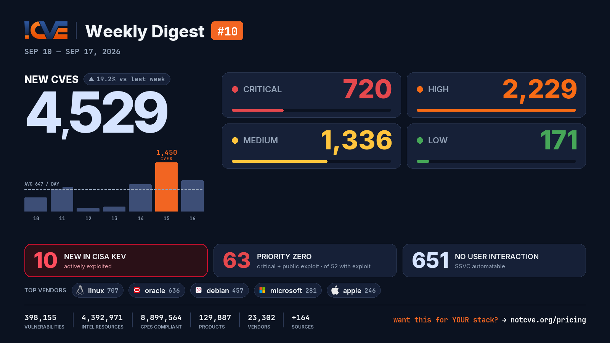

# 📊 Weekly Vulnerability Digest #10 — Sep 10–17, 2026

> Data window: 2026-09-10 → 2026-09-17 (UTC). Every figure in this report is generated deterministically from the [NotCVE](https://notcve.org) corpus and machine-validated — nothing is estimated.

## At a glance

- 🆕 **4,529 new CVEs** — 19.2% more than the previous week's 3,798
- 📅 **647 per day** on average
- 📈 **Peak day: 1,450** published on Sep 15 alone — 634 from oracle
- 🔴 **720 rated critical** (CVSS ≥ 9)
- 💥 **52 with a public exploit** already available
- 🚩 **63 rated critical AND with a public exploit**
- 🤖 **651 no user interaction needed** to exploit (CISA SSVC automatable)
- ⚠️ **10 added to CISA KEV** — actively exploited

## Severity of new CVEs

| Severity | Count | Distribution |
|---|---:|---|
| Critical | 720 | `████░░░░░░░░` |
| High | 2229 | `████████████` |
| Medium | 1336 | `███████░░░░░` |
| Low | 171 | `█░░░░░░░░░░░` |

## Top vendors

| Vendor | New CVEs | |
|---|---:|---|
| [linux](https://notcve.org/vendors/linux/) | 707 | `████████████` |
| [oracle](https://notcve.org/vendors/oracle/) | 636 | `███████████░` |
| [debian](https://notcve.org/vendors/debian/) | 457 | `████████░░░░` |
| [microsoft](https://notcve.org/vendors/microsoft/) | 281 | `█████░░░░░░░` |
| [apple](https://notcve.org/vendors/apple/) | 246 | `████░░░░░░░░` |
| [ibm](https://notcve.org/vendors/ibm/) | 168 | `███░░░░░░░░░` |
| [google](https://notcve.org/vendors/google/) | 143 | `██░░░░░░░░░░` |
| [kernel](https://notcve.org/vendors/kernel/) | 140 | `██░░░░░░░░░░` |

## Top products

| Product | Vendor | New CVEs |
|---|---|---:|
| [linux_kernel](https://notcve.org/vendors/linux/products/linux~20kernel/) | [linux](https://notcve.org/vendors/linux/) | 707 |
| [debian_linux](https://notcve.org/vendors/debian/products/debian~20linux/) | [debian](https://notcve.org/vendors/debian/) | 446 |
| [azure_linux](https://notcve.org/vendors/microsoft/products/azure~20linux/) | [microsoft](https://notcve.org/vendors/microsoft/) | 275 |
| [macos](https://notcve.org/vendors/apple/products/macos/) | [apple](https://notcve.org/vendors/apple/) | 222 |
| [bpftool](https://notcve.org/vendors/kernel/products/bpftool/) | [kernel](https://notcve.org/vendors/kernel/) | 140 |
| [iphone_os](https://notcve.org/vendors/apple/products/iphone~20os/) | [apple](https://notcve.org/vendors/apple/) | 139 |
| [ipados](https://notcve.org/vendors/apple/products/ipados/) | [apple](https://notcve.org/vendors/apple/) | 133 |
| [visionos](https://notcve.org/vendors/apple/products/visionos/) | [apple](https://notcve.org/vendors/apple/) | 100 |

## ⚠️ New in CISA KEV — actively exploited

| CVE | Title | CVSS | Added |
|---|---|---:|---|
| [CVE-2026-87886](https://notcve.org/cve/CVE-2026-87886/) | Acronis Backup Incorrect Default Permissions Vulnerability | 7.8 | 2026-09-16 |
| [CVE-2026-58704](https://notcve.org/cve/CVE-2026-58704/) | Google Pixel Improper Authorization Vulnerability | 8.8 | 2026-09-16 |
| [CVE-2026-76460](https://notcve.org/cve/CVE-2026-76460/) | Cisco Identity Services Engine Incorrect Use of Privileged APIs Vulnerability | 10 | 2026-09-16 |
| [CVE-2026-76461](https://notcve.org/cve/CVE-2026-76461/) | Cisco Secure Email Gateway SQL Injection Vulnerability | 9.8 | 2026-09-14 |
| [CVE-2026-42016](https://notcve.org/cve/CVE-2026-42016/) | JFrog Artifactory Incorrect Authorization Vulnerability | 8.8 | 2026-09-11 |
| [CVE-2026-42018](https://notcve.org/cve/CVE-2026-42018/) | JFrog Artifactory Improper Authentication Vulnerability | 7.5 | 2026-09-11 |
| [CVE-2026-84869](https://notcve.org/cve/CVE-2026-84869/) | ConnectWise ScreenConnect Improper Privilege Management and Missing Authorization Vulnerability | 9.9 | 2026-09-11 |
| [CVE-2026-85706](https://notcve.org/cve/CVE-2026-85706/) | GitLab Community Edition and Enterprise Edition Path Traversal Vulnerability | 10 | 2026-09-11 |
| [CVE-2026-86060](https://notcve.org/cve/CVE-2026-86060/) | MikroTik RouterOS Improper Neutralization of Argument Delimiters in a Command Vulnerability | 9.8 | 2026-09-10 |
| [CVE-2026-67277](https://notcve.org/cve/CVE-2026-67277/) | MikroTik RouterOS Missing Authentication for Critical Function Vulnerability | 8.8 | 2026-09-10 |

## Highest CVSS among new CVEs

| CVE | Title | CVSS |
|---|---|---:|
| [CVE-2026-87988](https://notcve.org/cve/CVE-2026-87988/) | mistralai mistral-vibe — Incorrect Permission Assignment for Critical Resource | 10 |
| [CVE-2026-8778](https://notcve.org/cve/CVE-2026-8778/) | MIPL Grouped Checkout Fields for WooCommerce <= 1.2.2 - Unauthenticated Arbitrary File Upload | 10 |
| [CVE-2026-81648](https://notcve.org/cve/CVE-2026-81648/) | CryptoPayment Gateway 1.2.1 - 1.2.2 - Unauthenticated Arbitrary File Deletion | 10 |
| [CVE-2026-77770](https://notcve.org/cve/CVE-2026-77770/) | miniOrange 2FA – Two Factor Authentication for WordPress 5.3.24 - 6.3.0 - Missing Authorization to Unauthenticated Arbit | 10 |
| [CVE-2026-53710](https://notcve.org/cve/CVE-2026-53710/) | RestrictedPython sandbox bypass via getattr builtin in python_sandbox_server | 10 |

## Highest EPSS among new CVEs

| CVE | Title | EPSS | CVSS |
|---|---|---:|---:|
| [CVE-2026-85706](https://notcve.org/cve/CVE-2026-85706/) | GitLab Community Edition and Enterprise Edition Path Traversal Vulnerability | 12% | 10 |
| [CVE-2026-76698](https://notcve.org/cve/CVE-2026-76698/) | Authenticated Command Injection Vulnerability leads to Denial-of-Service in HPE Networking EdgeConnect SD-WAN Gateways | 4.1% | 6.5 |
| [CVE-2026-81467](https://notcve.org/cve/CVE-2026-81467/) | Dell ThinOS 10 — Improper Neutralization of Special Elements used in an OS Command ('OS Command Injection') | 3.8% | 9.8 |
| [CVE-2026-17176](https://notcve.org/cve/CVE-2026-17176/) | OS command injection Vulnerability in Deco BE11000 | 3.6% | 8.8 |
| [CVE-2026-65638](https://notcve.org/cve/CVE-2026-65638/) | WebPros ConfigServer Security & Firewall — OS Command Injection | 3.2% | 9.2 |

## Triage signals

- 🤖 **SSVC breakdown**: 651 automatable (204 of them with total technical impact) · exploitation status: 5 active, 475 PoC
- 🌊 **Widest blast radius**: [CVE-2026-59679](https://notcve.org/cve/CVE-2026-59679/) — 99 products, 26 versions (fs_read_glyphs() heap OOB read/write via encoding array index mismatch in libXfont2)

## Top CNAs (who assigned this week)

| CNA | New CVEs |
|---|---:|
| Linux | 707 |
| oracle | 634 |
| VulnCheck | 438 |
| GitHub_M | 393 |
| VulDB | 263 |

---

**About this series** — published every Thursday from the NotCVE corpus: 398,155 vulnerability records · 4,392,971 intel resources · 8,899,564 CPEs compliant · 129,887 products · 23,302 vendors · 164 monitored sources → [notcve.org](https://notcve.org)
