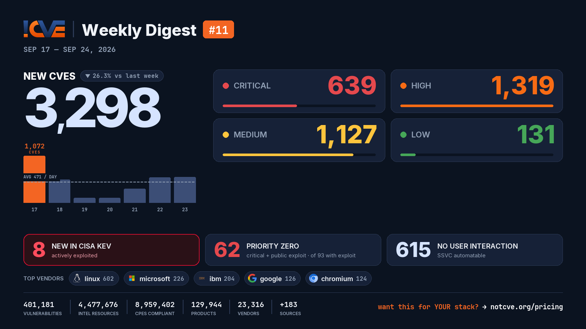

# 📊 Weekly Vulnerability Digest #11 — Sep 17–24, 2026

> Data window: 2026-09-17 → 2026-09-24 (UTC). Every figure in this report is generated deterministically from the [NotCVE](https://notcve.org) corpus and machine-validated — nothing is estimated.

## At a glance

- 🆕 **3,298 new CVEs** — 26.3% fewer than the previous week's 4,476
- 📅 **471 per day** on average
- 📈 **Peak day: 1,072** published on Sep 17 alone — 602 from linux
- 🔴 **639 rated critical** (CVSS ≥ 9)
- 💥 **93 with a public exploit** already available
- 🚩 **62 rated critical AND with a public exploit**
- 🤖 **615 no user interaction needed** to exploit (CISA SSVC automatable)
- ⚠️ **8 added to CISA KEV** — actively exploited

## Severity of new CVEs

| Severity | Count | Distribution |
|---|---:|---|
| Critical | 639 | `██████░░░░░░` |
| High | 1319 | `████████████` |
| Medium | 1127 | `██████████░░` |
| Low | 131 | `█░░░░░░░░░░░` |

## Top vendors

| Vendor | New CVEs | |
|---|---:|---|
| [linux](https://notcve.org/vendors/linux/) | 602 | `████████████` |
| [microsoft](https://notcve.org/vendors/microsoft/) | 226 | `█████░░░░░░░` |
| [ibm](https://notcve.org/vendors/ibm/) | 204 | `████░░░░░░░░` |
| [google](https://notcve.org/vendors/google/) | 126 | `███░░░░░░░░░` |
| [chromium](https://notcve.org/vendors/chromium/) | 124 | `██░░░░░░░░░░` |
| [redhat](https://notcve.org/vendors/redhat/) | 122 | `██░░░░░░░░░░` |
| [debian](https://notcve.org/vendors/debian/) | 80 | `██░░░░░░░░░░` |
| [canonical](https://notcve.org/vendors/canonical/) | 65 | `█░░░░░░░░░░░` |

## Top products

| Product | Vendor | New CVEs |
|---|---|---:|
| [linux_kernel](https://notcve.org/vendors/linux/products/linux~20kernel/) | [linux](https://notcve.org/vendors/linux/) | 602 |
| [azure_linux](https://notcve.org/vendors/microsoft/products/azure~20linux/) | [microsoft](https://notcve.org/vendors/microsoft/) | 206 |
| [chromium](https://notcve.org/vendors/chromium/products/chromium/) | [chromium](https://notcve.org/vendors/chromium/) | 124 |
| [chrome](https://notcve.org/vendors/google/products/chrome/) | [google](https://notcve.org/vendors/google/) | 124 |
| [debian_linux](https://notcve.org/vendors/debian/products/debian~20linux/) | [debian](https://notcve.org/vendors/debian/) | 80 |
| [guardium_data_protection](https://notcve.org/vendors/ibm/products/guardium~20data~20protection/) | [ibm](https://notcve.org/vendors/ibm/) | 69 |
| [ubuntu_linux](https://notcve.org/vendors/canonical/products/ubuntu~20linux/) | [canonical](https://notcve.org/vendors/canonical/) | 65 |
| [fedora](https://notcve.org/vendors/fedoraproject/products/fedora/) | fedoraproject | 62 |

## ⚠️ New in CISA KEV — actively exploited

| CVE | Title | CVSS | Added |
|---|---|---:|---|
| [CVE-2026-94127](https://notcve.org/cve/CVE-2026-94127/) | F5 BIG-IP APM Heap-based Buffer Overflow Vulnerability | 9.8 | 2026-09-22 |
| [CVE-2026-85102](https://notcve.org/cve/CVE-2026-85102/) | Check Point Multiple Products Improper Certificate Validation Vulnerability | 9.8 | 2026-09-22 |
| [CVE-2026-93616](https://notcve.org/cve/CVE-2026-93616/) | Check Point Multiple Products Path Traversal Vulnerability | 9.8 | 2026-09-22 |
| [CVE-2026-93952](https://notcve.org/cve/CVE-2026-93952/) | Arista VeloCloud Orchestrator Improper Input Validation Vulnerability | 10 | 2026-09-22 |
| [CVE-2026-7273](https://notcve.org/cve/CVE-2026-7273/) | Zyxel GS1900 Series Switches Stack-Based Buffer Overflow Vulnerability | 8.8 | 2026-09-21 |
| [CVE-2025-39964](https://notcve.org/cve/CVE-2025-39964/) | Linux Kernel Race Condition Vulnerability | 7.8 | 2026-09-18 |
| [CVE-2026-53266](https://notcve.org/cve/CVE-2026-53266/) | Linux Kernel Out-of-Bounds Write Vulnerability | 8.8 | 2026-09-18 |
| [CVE-2025-39682](https://notcve.org/cve/CVE-2025-39682/) | Linux Kernel Improper Check for Unusual or Exceptional Conditions Vulnerability | 9.8 | 2026-09-18 |

## Highest CVSS among new CVEs

| CVE | Title | CVSS |
|---|---|---:|
| [CVE-2026-59167](https://notcve.org/cve/CVE-2026-59167/) | [Security] Critical XSS vulnerability - sanitizer bypass | 10 |
| [CVE-2026-70200](https://notcve.org/cve/CVE-2026-70200/) | Azure Logic Apps Elevation of Privilege Vulnerability | 10 |
| [CVE-2026-92960](https://notcve.org/cve/CVE-2026-92960/) | vm2 before 3.11.6 Process-wide State Exposure via os and dns | 10 |
| [CVE-2026-80155](https://notcve.org/cve/CVE-2026-80155/) | Lantronix Autonomous Out-of-Band Devices Unauthenticated Authentication Bypass via snprintf Path Truncation | 10 |
| [CVE-2026-86708](https://notcve.org/cve/CVE-2026-86708/) | Sensitive data exposure | 10 |

## Highest EPSS among new CVEs

| CVE | Title | EPSS | CVSS |
|---|---|---:|---:|
| [CVE-2026-74849](https://notcve.org/cve/CVE-2026-74849/) | Remote code execution vulnerability | 4.6% | 9.8 |
| [CVE-2026-95675](https://notcve.org/cve/CVE-2026-95675/) | D-Link DAP-1360 6.14 Unauthenticated RCE via Web Management Interface | 3.9% | 9.8 |
| [CVE-2026-76978](https://notcve.org/cve/CVE-2026-76978/) | Command Injection vulnerability | 3.7% | 8.8 |
| [CVE-2026-94098](https://notcve.org/cve/CVE-2026-94098/) | Netcore NBR200V2 Firmware Upgrade CGI Endpoint upgrade command injection | 3.7% | 9.4 |
| [CVE-2026-94097](https://notcve.org/cve/CVE-2026-94097/) | Netcore NBR200V2 CGI Diagnostic Endpoint network_tools command injection | 3.6% | 10 |

## Triage signals

- 🤖 **SSVC breakdown**: 615 automatable (158 of them with total technical impact) · exploitation status: 4 active, 478 PoC
- 🌊 **Widest blast radius**: [CVE-2026-25275](https://notcve.org/cve/CVE-2026-25275/) — 778 products, 1 versions (Buffer Over-read in WLAN Firmware)

## Top CNAs (who assigned this week)

| CNA | New CVEs |
|---|---:|
| Linux | 602 |
| GitHub_M | 559 |
| VulnCheck | 248 |
| VulDB | 180 |
| WPScan | 167 |

---

**About this series** — published every Thursday from the NotCVE corpus: 401,181 vulnerability records · 4,477,676 intel resources · 8,959,402 CPEs compliant · 129,944 products · 23,316 vendors · 183 monitored sources → [notcve.org](https://notcve.org)
