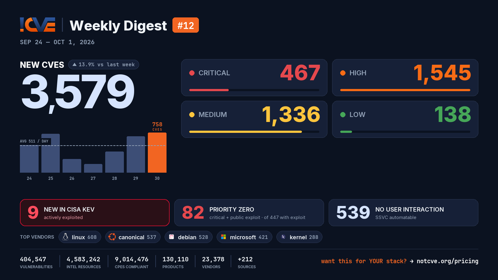

# 📊 Weekly Vulnerability Digest #12 — Sep 24 – Oct 1, 2026

> Data window: 2026-09-24 → 2026-10-01 (UTC). Every figure in this report is generated deterministically from the [NotCVE](https://notcve.org) corpus and machine-validated — nothing is estimated.

## At a glance

- 🆕 **3,579 new CVEs** — 13.9% more than the previous week's 3,142
- 📅 **511 per day** on average
- 📈 **Peak day: 758** published on Sep 30 alone
- 🔴 **467 rated critical** (CVSS ≥ 9)
- 💥 **447 with a public exploit** already available
- 🚩 **82 rated critical AND with a public exploit**
- 🤖 **539 no user interaction needed** to exploit (CISA SSVC automatable)
- ⚠️ **9 added to CISA KEV** — actively exploited

## Severity of new CVEs

| Severity | Count | Distribution |
|---|---:|---|
| Critical | 467 | `████░░░░░░░░` |
| High | 1545 | `████████████` |
| Medium | 1336 | `██████████░░` |
| Low | 138 | `█░░░░░░░░░░░` |

## Top vendors

| Vendor | New CVEs | |
|---|---:|---|
| [linux](https://notcve.org/vendors/linux/) | 608 | `████████████` |
| [canonical](https://notcve.org/vendors/canonical/) | 537 | `███████████░` |
| [debian](https://notcve.org/vendors/debian/) | 528 | `██████████░░` |
| [microsoft](https://notcve.org/vendors/microsoft/) | 421 | `████████░░░░` |
| [kernel](https://notcve.org/vendors/kernel/) | 288 | `██████░░░░░░` |
| [google](https://notcve.org/vendors/google/) | 151 | `███░░░░░░░░░` |
| [chromium](https://notcve.org/vendors/chromium/) | 141 | `███░░░░░░░░░` |
| [fedoraproject](https://notcve.org/vendors/fedoraproject/) | 133 | `███░░░░░░░░░` |

## Top products

| Product | Vendor | New CVEs |
|---|---|---:|
| [linux_kernel](https://notcve.org/vendors/linux/products/linux~20kernel/) | [linux](https://notcve.org/vendors/linux/) | 608 |
| [ubuntu_linux](https://notcve.org/vendors/canonical/products/ubuntu~20linux/) | [canonical](https://notcve.org/vendors/canonical/) | 530 |
| [debian_linux](https://notcve.org/vendors/debian/products/debian~20linux/) | [debian](https://notcve.org/vendors/debian/) | 528 |
| [azure_linux](https://notcve.org/vendors/microsoft/products/azure~20linux/) | [microsoft](https://notcve.org/vendors/microsoft/) | 420 |
| [bpftool](https://notcve.org/vendors/kernel/products/bpftool/) | [kernel](https://notcve.org/vendors/kernel/) | 288 |
| [chromium](https://notcve.org/vendors/chromium/products/chromium/) | [chromium](https://notcve.org/vendors/chromium/) | 141 |
| [chrome](https://notcve.org/vendors/google/products/chrome/) | [google](https://notcve.org/vendors/google/) | 141 |
| [fedora](https://notcve.org/vendors/fedoraproject/products/fedora/) | [fedoraproject](https://notcve.org/vendors/fedoraproject/) | 133 |

## ⚠️ New in CISA KEV — actively exploited

| CVE | Title | CVSS | Added |
|---|---|---:|---|
| [CVE-2026-76504](https://notcve.org/cve/CVE-2026-76504/) | Cisco Catalyst SD-WAN Manager Hex Encoding Vulnerability | 9.8 | 2026-09-30 |
| [CVE-2026-86950](https://notcve.org/cve/CVE-2026-86950/) | Apple Multiple Products Out-of-Bounds Write Vulnerability | 8.8 | 2026-09-29 |
| [CVE-2026-88772](https://notcve.org/cve/CVE-2026-88772/) | Citrix NetScaler Improper Restriction of Operations within the Bounds of a Memory Buffer Vulnerability | 9.8 | 2026-09-27 |
| [CVE-2026-88771](https://notcve.org/cve/CVE-2026-88771/) | Citrix NetScaler Improper Input Validation Vulnerability | 9.8 | 2026-09-27 |
| [CVE-2026-65660](https://notcve.org/cve/CVE-2026-65660/) | Microsoft SharePoint Code Injection Vulnerability | 8.8 | 2026-09-25 |
| [CVE-2026-87902](https://notcve.org/cve/CVE-2026-87902/) | WordPress Core Remote File Inclusion Vulnerability | 9.2 | 2026-09-25 |
| [CVE-2026-67279](https://notcve.org/cve/CVE-2026-67279/) | Mikrotik RouterOS Improper Enforcement of Behavioral Workflow Vulnerability | 6.9 | 2026-09-25 |
| [CVE-2026-71362](https://notcve.org/cve/CVE-2026-71362/) | Adobe Commerce and Magento Incorrect Authorization Vulnerability | 9.1 | 2026-09-24 |
| [CVE-2026-5430](https://notcve.org/cve/CVE-2026-5430/) | WSO2 Multiple Products Path Traversal Vulnerability | 10 | 2026-09-24 |

## Highest CVSS among new CVEs

| CVE | Title | CVSS |
|---|---|---:|
| [CVE-2026-96587](https://notcve.org/cve/CVE-2026-96587/) | Use of Hard-coded Credentials in Viidure Dashcam Android Application | 10 |
| [CVE-2026-88773](https://notcve.org/cve/CVE-2026-88773/) | HTTP Request Smuggling | 10 |
| [CVE-2026-94603](https://notcve.org/cve/CVE-2026-94603/) | The `podman run` command can be instructed to disable almost all sandboxing - including user-requested sandboxing - by i | 10 |
| [CVE-2026-100775](https://notcve.org/cve/CVE-2026-100775/) | Sandbox escape in the Graphics component | 10 |
| [CVE-2026-101076](https://notcve.org/cve/CVE-2026-101076/) | Netcore NR289-GE CGI set_ntp_server_ip.cgi system os command injection | 10 |

## Highest EPSS among new CVEs

| CVE | Title | EPSS | CVSS |
|---|---|---:|---:|
| [CVE-2026-12269](https://notcve.org/cve/CVE-2026-12269/) | Authenticated File Write to RCE via keepalived in DDI Central | 7% | 8.8 |
| [CVE-2026-12268](https://notcve.org/cve/CVE-2026-12268/) | Authenticated PowerShell Injection leads to RCE | 4.7% | 8.8 |
| [CVE-2026-100852](https://notcve.org/cve/CVE-2026-100852/) | AzuraCast before 0.23.8 Command Injection via Streamer Username | 3.7% | 8.8 |
| [CVE-2026-12267](https://notcve.org/cve/CVE-2026-12267/) | Authenticated PowerShell Injection in DNS Query Resolution Policy leads to RCE | 3.6% | 7.2 |
| [CVE-2026-102792](https://notcve.org/cve/CVE-2026-102792/) | Ziroom ZHOME A0101 set_syslog command injection | 3% | 9.4 |

## Triage signals

- 🤖 **SSVC breakdown**: 539 automatable (125 of them with total technical impact) · exploitation status: 4 active, 560 PoC
- 🌊 **Widest blast radius**: [CVE-2026-17511](https://notcve.org/cve/CVE-2026-17511/) — 54 products, 0 versions (This Power System update is being released to address)

## Top CNAs (who assigned this week)

| CNA | New CVEs |
|---|---:|
| Linux | 608 |
| VulnCheck | 456 |
| GitHub_M | 295 |
| VulDB | 240 |
| Patchstack | 150 |

---

**About this series** — published every Thursday from the NotCVE corpus: 404,547 vulnerability records · 4,583,242 intel resources · 9,014,476 CPEs compliant · 130,110 products · 23,378 vendors · 212 monitored sources → [notcve.org](https://notcve.org)
