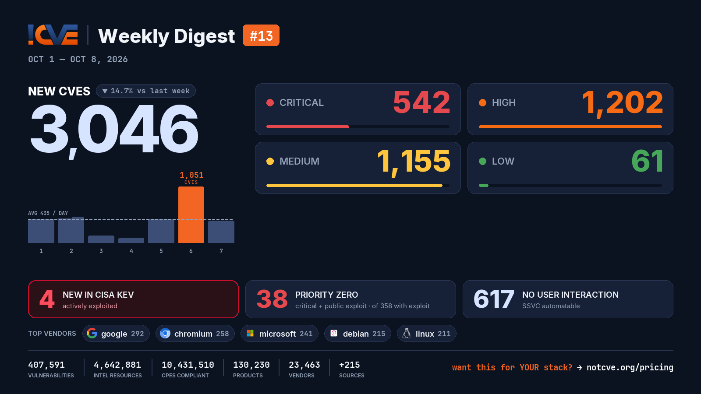

# 📊 Weekly Vulnerability Digest #13 — Oct 1–8, 2026

> Data window: 2026-10-01 → 2026-10-08 (UTC). Every figure in this report is generated deterministically from the [NotCVE](https://notcve.org) corpus and machine-validated — nothing is estimated.

## At a glance

- 🆕 **3,046 new CVEs** — 14.7% fewer than the previous week's 3,573
- 📅 **435 per day** on average
- 📈 **Peak day: 1,051** published on Oct 6 alone
- 🔴 **542 rated critical** (CVSS ≥ 9)
- 💥 **358 with a public exploit** already available
- 🚩 **38 rated critical AND with a public exploit**
- 🤖 **617 no user interaction needed** to exploit (CISA SSVC automatable)
- ⚠️ **4 added to CISA KEV** — actively exploited

## Severity of new CVEs

| Severity | Count | Distribution |
|---|---:|---|
| Critical | 542 | `█████░░░░░░░` |
| High | 1202 | `████████████` |
| Medium | 1155 | `████████████` |
| Low | 61 | `█░░░░░░░░░░░` |

## Top vendors

| Vendor | New CVEs | |
|---|---:|---|
| [google](https://notcve.org/vendors/google/) | 292 | `████████████` |
| [chromium](https://notcve.org/vendors/chromium/) | 258 | `███████████░` |
| [microsoft](https://notcve.org/vendors/microsoft/) | 241 | `██████████░░` |
| [debian](https://notcve.org/vendors/debian/) | 215 | `█████████░░░` |
| [linux](https://notcve.org/vendors/linux/) | 211 | `█████████░░░` |
| [apache](https://notcve.org/vendors/apache/) | 119 | `█████░░░░░░░` |
| [redhat](https://notcve.org/vendors/redhat/) | 90 | `████░░░░░░░░` |
| [ibm](https://notcve.org/vendors/ibm/) | 77 | `███░░░░░░░░░` |

## Top products

| Product | Vendor | New CVEs |
|---|---|---:|
| [chromium](https://notcve.org/vendors/chromium/products/chromium/) | [chromium](https://notcve.org/vendors/chromium/) | 258 |
| [chrome](https://notcve.org/vendors/google/products/chrome/) | [google](https://notcve.org/vendors/google/) | 258 |
| [azure_linux](https://notcve.org/vendors/microsoft/products/azure~20linux/) | [microsoft](https://notcve.org/vendors/microsoft/) | 229 |
| [debian_linux](https://notcve.org/vendors/debian/products/debian~20linux/) | [debian](https://notcve.org/vendors/debian/) | 215 |
| [linux_kernel](https://notcve.org/vendors/linux/products/linux~20kernel/) | [linux](https://notcve.org/vendors/linux/) | 211 |
| [thrift](https://notcve.org/vendors/apache/products/thrift/) | [apache](https://notcve.org/vendors/apache/) | 61 |
| [ghost](https://notcve.org/vendors/ghost/products/ghost/) | ghost | 54 |
| [enterprise_linux](https://notcve.org/vendors/redhat/products/enterprise~20linux/) | [redhat](https://notcve.org/vendors/redhat/) | 53 |

## ⚠️ New in CISA KEV — actively exploited

| CVE | Title | CVSS | Added |
|---|---|---:|---|
| [CVE-2026-88779](https://notcve.org/cve/CVE-2026-88779/) | Citrix NetScaler Improper Restriction of Operations within the Bounds of a Memory Buffer Vulnerability | 9.1 | 2026-10-04 |
| [CVE-2026-102490](https://notcve.org/cve/CVE-2026-102490/) | Zammad GmbH Zammad Improper Privilege Management Vulnerability | 9.8 | 2026-10-02 |
| [CVE-2026-102489](https://notcve.org/cve/CVE-2026-102489/) | Zammad GmbH Zammad Session Fixation Vulnerability | 9.8 | 2026-10-02 |
| [CVE-2026-104286](https://notcve.org/cve/CVE-2026-104286/) | Fortinet FortiMail Path Traversal Vulnerability | 9.8 | 2026-10-01 |

## Highest CVSS among new CVEs

| CVE | Title | CVSS |
|---|---|---:|
| [CVE-2026-101148](https://notcve.org/cve/CVE-2026-101148/) | WordPress BackupSheep WordPress Backup Plugin plugin <= 1.8 - Unauthenticated Arbitrary File Deletion and Backup Exfiltr | 10 |
| [CVE-2026-71449](https://notcve.org/cve/CVE-2026-71449/) | Johnson Controls EasyIO FS32 — Use of Hard-coded Cryptographic Key | 10 |
| [CVE-2026-105284](https://notcve.org/cve/CVE-2026-105284/) | Totolink A3002MU Authentication Check boa sub_40FCFC improper authorization | 10 |
| [CVE-2026-100103](https://notcve.org/cve/CVE-2026-100103/) | Authentication bypass via default auth token in P4Search | 10 |
| [CVE-2026-103956](https://notcve.org/cve/CVE-2026-103956/) | Missing authentication for critical function in Loom for AWS | 10 |

## Highest EPSS among new CVEs

| CVE | Title | EPSS | CVSS |
|---|---|---:|---:|
| [CVE-2026-104286](https://notcve.org/cve/CVE-2026-104286/) | Fortinet FortiMail Path Traversal Vulnerability | 2.2% | 9.8 |
| [CVE-2026-105484](https://notcve.org/cve/CVE-2026-105484/) | TOTOLINK X6000R UploadFirmwareFile cstecgi.cgi firmware_check os command injection | 2.1% | 10 |
| [CVE-2026-76146](https://notcve.org/cve/CVE-2026-76146/) | Genians, Inc Genian SSL PNS OS Command Injection | 1.9% | 8.4 |
| [CVE-2026-91140](https://notcve.org/cve/CVE-2026-91140/) | OS command injection in Progress Software Autonomous REST Connector GenAI Agents | 1.9% | 9.6 |
| [CVE-2026-21589](https://notcve.org/cve/CVE-2026-21589/) | Atlassian bamboo_data_center Files or Directories Accessible to External Parties | 1.8% | 9.8 |

## Triage signals

- 🤖 **SSVC breakdown**: 617 automatable (155 of them with total technical impact) · exploitation status: 2 active, 377 PoC
- 🌊 **Widest blast radius**: [CVE-2026-25302](https://notcve.org/cve/CVE-2026-25302/) — 613 products, 1 versions (Improper Verification of Cryptographic Signature in Boot)

## Top CNAs (who assigned this week)

| CNA | New CVEs |
|---|---:|
| GitHub_M | 343 |
| Patchstack | 282 |
| Chrome | 258 |
| VulnCheck | 249 |
| Linux | 209 |

---

**About this series** — published every Thursday from the NotCVE corpus: 407,591 vulnerability records · 4,642,881 intel resources · 10,431,510 CPEs compliant · 130,230 products · 23,463 vendors · 215 monitored sources → [notcve.org](https://notcve.org)
